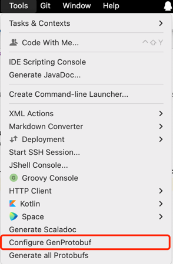
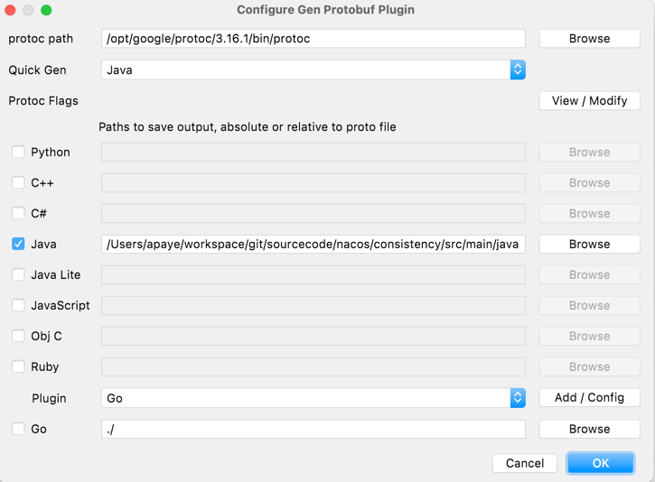
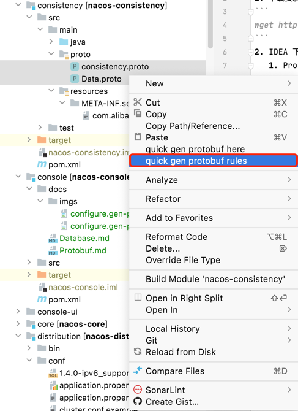

# Google Protobuf
1. 下载安装对应版本 Protobuf
```
wget https://github.com/protocolbuffers/protobuf/releases
```
2. IDEA 下载插件
    1. Protocol Buffer Editor
    2. GenProtobuf
3. 配置IDEA 插件
    1. IDEA菜单栏 --> Tools --> Configure GenProtobuf --> 配置地址
       
    2. 配置Protobuf安装位置、代码语言、代码生成地址
       
4. 生成代码
    1. 选择需要生成的.proto文件，右键选择 quick gen protobuf rules
        
   